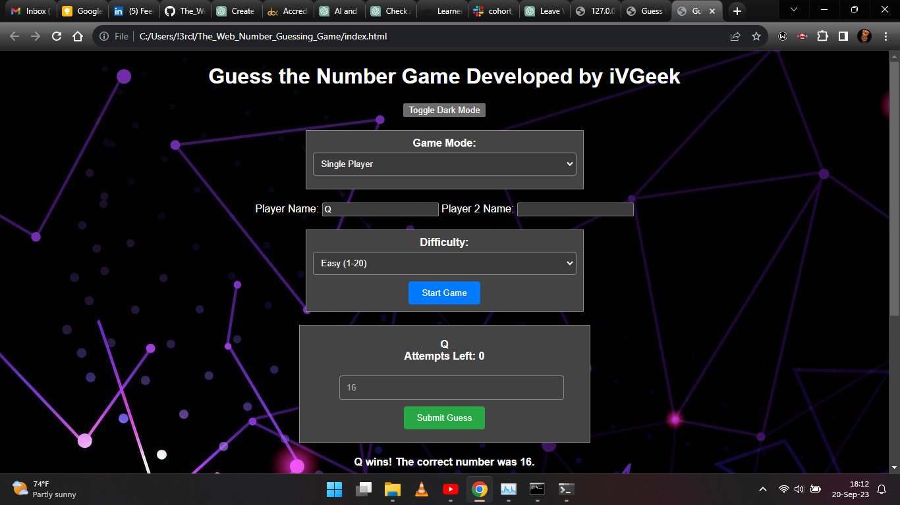
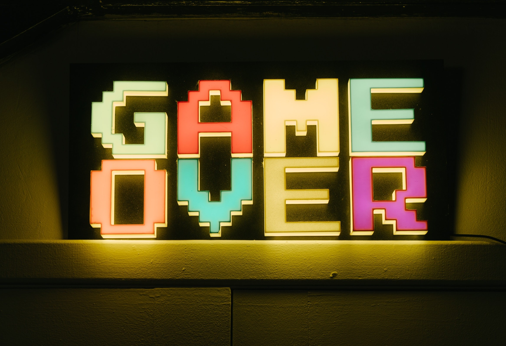

# Guess the Number Game

## Introduction

Welcome to the "Guess the Number" game! This classic number guessing game challenges your skills and intuition. Try to guess the correct number within a limited number of attempts and earn the highest score.

## Features

- **Background Image:** Enjoy a visually pleasing background image that complements the game's theme.

- **Sound Effects:** Immerse yourself in the game with interactive sound effects for correct and incorrect guesses. Feel the excitement of victory and the tension of close calls.

- **Bouncing "Restart" Button:** Experience a playful touch with a bouncing animation effect on the "Restart" button. Click to start a new game anytime.

- **Responsive Design:** Play the game on various devices with ease. The interface adapts to different screen sizes, providing a seamless experience on both desktop and mobile.

- **Score Tracking:** Keep track of your attempts and score. Each guess deducts points, so aim for fewer attempts to achieve a higher score.

## How to Play

1. Enter your guess in the input field.
2. Click the "Guess" button to submit your guess.
3. Receive feedback on your guess—whether it's too low or too high.
4. Continue guessing until you correctly identify the hidden number or reach the maximum number of attempts.
5. Enjoy sound effects for correct and incorrect guesses.
6. Click the "Restart" button to start a new game at any time.

## Installation

1. Clone this repository to your local machine.

2. Open the `index.html` file in your web browser to start playing.

## Audio Credits

- Sound effects by [zapsplat](https://www.zapsplat.com/):
 
## License

This game is provided under the [MIT License](LICENSE).

## Acknowledgments

- Thanks to the developers of the TermColor, PyFiglet, and PyAudio libraries for inspiration and ideas.

Have fun playing the game!

