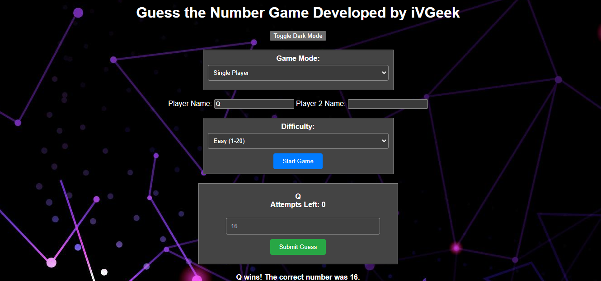

# Guess the Number Game

## Introduction

Welcome to the "Multiplayer Guess the Number" game! This classic number guessing game has been enhanced to support both single and multiplayer modes. Challenge your skills, intuition, and your friends in this exciting game. Try to guess the correct number within a limited number of attempts and earn the highest score.

## Features

- **Background Image:** Enjoy a visually pleasing background image that complements the game's theme.

- **Sound Effects:** Immerse yourself in the game with interactive sound effects for correct and incorrect guesses. Feel the excitement of victory and the tension of close calls.

- **Bouncing "Start Game" Button:** Experience a playful touch with a bouncing animation effect on the "Start Game" button. Click to start a new game anytime.

- **Responsive Design:** Play the game on various devices with ease. The interface adapts to different screen sizes, providing a seamless experience on both desktop and mobile.

- **Score Tracking:** Keep track of your attempts and score. Each guess deducts points, so aim for fewer attempts to achieve a higher score.

- **Multiplayer Mode:** Challenge your friends in multiplayer mode. Compete to see who can guess the correct number first.

## How to Play

1. Select your game mode: "Single Player" or "Multiplayer."
2. Enter your name (for single player) or both players' names (for multiplayer).
3. Choose the difficulty level: "Easy," "Medium," or "Hard."
4. Click the "Start Game" button to begin the game.
5. In multiplayer mode, take turns guessing the correct number.
6. Enter your guess in the input field and click "Submit Guess."
7. Receive feedback on your guess—whether it's too low or too high.
8. Continue guessing until you correctly identify the hidden number or reach the maximum number of attempts.
9. Enjoy sound effects for correct and incorrect guesses.
10. Click the "Start Game" button to start a new game at any time.

## Launch
Play the Guess the Word Game here (good luck!): https://ivgeek.github.io/The_Web_Number_Guessing_Game/

## Audio Credits

- Sound effects by [zapsplat](https://www.zapsplat.com/).

## License

This game is provided under the [MIT License](LICENSE).

## Acknowledgments

- Thanks to the developers of the TermColor, PyFiglet, and PyAudio libraries for inspiration and ideas.

Have fun playing the game!

